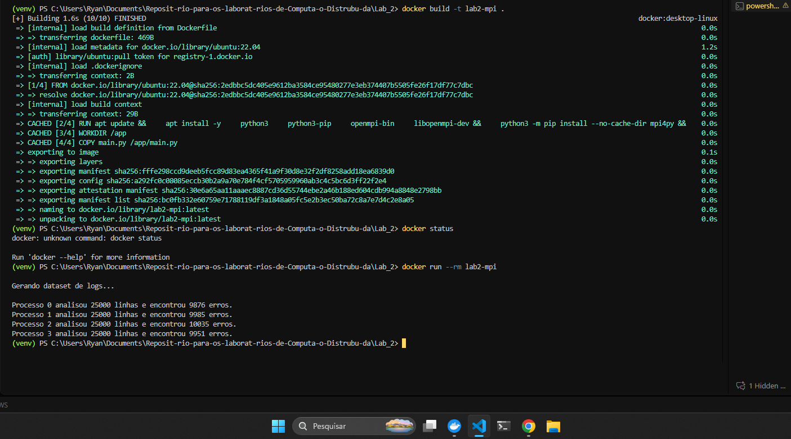

# Relatorio - Processamento Distribuido de Logs com MPI

**Aluno:** Ryan Ledo  
**RA:** 10352727  
**Disciplina:** Computacao Distribuida  
**Laboratorio:** Lab 2

## 1. Objetivo

O objetivo deste laboratorio foi desenvolver um programa em Python utilizando a biblioteca `mpi4py` para processar um grande conjunto de logs de forma distribuida. O dataset foi gerado em memoria pelo processo master e dividido entre os processos MPI utilizando a operacao coletiva `Scatter`.

Cada processo analisou somente a sua parte dos dados e contou os registros com status `404` ou `500`. Ao final, cada processo enviou ao master uma mensagem contendo seu rank, a quantidade de linhas analisadas e a quantidade de erros encontrados.

## 2. Tecnologias utilizadas

- Python 3
- `mpi4py`
- OpenMPI
- Docker
- Ubuntu 22.04

## 3. Implementacao

O processo de execucao foi dividido nas seguintes etapas:

1. O processo 0 gerou 100.000 logs aleatorios em memoria.
2. Cada log foi criado no formato:

	```text
	IP METODO ENDPOINT STATUS
	```

3. O dataset foi dividido em partes iguais. Como foram utilizados quatro processos, cada processo recebeu 25.000 linhas.
4. A distribuicao foi feita com `comm.scatter(..., root=0)`.
5. Cada processo separou os campos de cada log e verificou o codigo de status.
6. Os status `404` e `500` foram contabilizados como erros.
7. Os processos workers enviaram seus resultados ao master usando `comm.send()`.
8. O processo master recebeu as mensagens usando `comm.recv()` e imprimiu os resultados.

O programa nao utiliza `Gather` ou `Reduce`, conforme especificado na atividade. A comunicacao coletiva foi utilizada somente para distribuir as partes do dataset, enquanto os resultados foram enviados por mensagens ponto a ponto.

## 4. Execucao

A imagem Docker foi criada com o comando:

```powershell
docker build -t lab2-mpi -f .\Lab_2\Dockerfile .\Lab_2
```

Em seguida, o programa foi executado com:

```powershell
docker run --rm lab2-mpi
```

## 5. Resultado obtido

A saida produzida pelo programa foi:

```text
Gerando dataset de logs...

Processo 0 analisou 25000 linhas e encontrou 9939 erros.
Processo 1 analisou 25000 linhas e encontrou 10088 erros.
Processo 2 analisou 25000 linhas e encontrou 9994 erros.
Processo 3 analisou 25000 linhas e encontrou 9878 erros.
```

Resumo da execucao:

| Processo | Linhas analisadas | Erros encontrados |
|----------|-------------------:|------------------:|
| 0        | 25.000             | 9.939             |
| 1        | 25.000             | 10.088            |
| 2        | 25.000             | 9.994             |
| 3        | 25.000             | 9.878             |
| **Total** | **100.000**       | **39.899**        |

## 6. Analise dos resultados

Os resultados mostram que a distribuicao foi realizada corretamente, pois os quatro processos analisaram exatamente 25.000 linhas cada. A soma das linhas processadas corresponde ao total de 100.000 logs gerados pelo processo 0.

Foram encontrados 39.899 erros no total. Como os status foram escolhidos aleatoriamente, e os codigos `404` e `500` representam dois dos cinco valores possiveis da lista de status, e esperado que aproximadamente 40% dos logs sejam classificados como erros. O resultado obtido corresponde a essa expectativa.

As quantidades de erros variam entre os processos porque os logs foram gerados aleatoriamente. Essa variacao nao indica falha na distribuicao; o importante e que cada processo recebeu a mesma quantidade de linhas e processou exclusivamente a sua propria particao.

## 7. Print da execução na minha máquina



## 8. Conclusao

O programa atendeu aos requisitos da atividade. Foi utilizado Python com `mpi4py`, o dataset foi gerado em memoria pelo processo 0, a distribuicao foi feita obrigatoriamente com `Scatter`, cada processo analisou somente sua parte dos dados e os resultados foram enviados ao master em mensagens individuais.

A execucao em Docker tambem permitiu reunir Python, `mpi4py` e OpenMPI em um ambiente controlado, garantindo que o programa fosse executado com quatro processos MPI.
