# Computação Distribuída com MPI: Multiplicação de Matrizes e Método de Monte Carlo

**Laboratório 3 — MPI + Python + Docker**

| | |
|---|---|
| **Aluno** | Ryan Ledo |
| **RA** | 10352727 |
| **Instituição** | FCI — Universidade Presbiteriana Mackenzie |
| **Disciplina** | Computação Distribuída |
| **Turma** | 06N |
| **Professores** | Prof. Mário |
| **Data de entrega** | 20/09/2026 |

---

## 1. Introdução e Fundamentação Teórica

### 1.1 Objetivo

Este laboratório teve como objetivo implementar, executar e avaliar dois programas
distribuídos em Python com a biblioteca `mpi4py`, executados sobre um cluster simulado
de quatro containers Docker:

- **Exercício 1** — multiplicação de duas matrizes quadradas $N \times N$ com
  particionamento de linhas entre os processos MPI;
- **Exercício 2** — estimativa da constante $\pi$ pelo método de Monte Carlo com
  agregação dos contadores locais por redução.

Além das versões distribuídas, foram implementadas versões sequencial e multithreaded
locais, de modo a permitir uma comparação de desempenho entre os três modelos de
execução.

### 1.2 O modelo de programação MPI

Uma aplicação MPI (*Message Passing Interface*) é composta por múltiplos processos
independentes, com espaços de endereçamento separados, que executam o mesmo binário
simultaneamente. Cada processo recebe um identificador único, o **rank**, no intervalo
$[0, size-1]$, e é a partir dele que o programa decide qual subconjunto do trabalho cada
processo deve executar. Em Python, o ambiente MPI é inicializado automaticamente na
importação de `mpi4py`:

```python
from mpi4py import MPI

comm = MPI.COMM_WORLD   # comunicador global
size = comm.Get_size()  # número total de processos
rank = comm.Get_rank()  # identificador deste processo
```

Como não há memória compartilhada entre os processos, toda troca de informação ocorre
explicitamente por mensagens — e é justamente esse custo de comunicação o fator que
determina se a distribuição compensa ou não, como será discutido na Seção 6.

### 1.3 Comunicação coletiva

Operações coletivas envolvem simultaneamente todos os processos do comunicador. As três
utilizadas neste laboratório são:

| Operação | Assinatura | Semântica |
|---|---|---|
| **Broadcast** | `dados = comm.bcast(obj, root=0)` | Replica um dado do processo `root` para todos os demais. Ao final, todos os ranks possuem uma cópia idêntica. Usada no Exercício 1 para distribuir as matrizes $A$ e $B$. |
| **Gather** | `lista = comm.gather(local, root=0)` | Reúne o valor local de cada processo em uma lista ordenada por rank no processo `root`; os demais recebem `None`. Usada no Exercício 1 para remontar a matriz $C$. |
| **Reduce** | `total = comm.reduce(local, op=MPI.SUM, root=0)` | Combina os valores locais por meio de um operador associativo (`MPI.SUM`, `MPI.MAX`, `MPI.MIN`, `MPI.PROD`) e entrega o resultado ao `root`. Usada no Exercício 2 para somar os contadores de pontos internos. |

Vale registrar a distinção entre as duas interfaces oferecidas pelo `mpi4py`: as funções
com inicial **minúscula** (`bcast`, `gather`, `reduce`) aceitam qualquer objeto Python
serializável, mas pagam o custo de serialização via `pickle`; as com inicial
**maiúscula** (`Bcast`, `Gather`, `Reduce`) operam diretamente sobre buffers contíguos de
memória, como `numpy.ndarray`, eliminando a serialização. Esta implementação usa a
interface de alto nível, o que é relevante para interpretar os tempos medidos.

### 1.4 Particionamento de dados na multiplicação de matrizes

Para matrizes quadradas $A$ e $B$ de dimensão $N \times N$, a matriz resultante
$C = A \times B$ é definida por:

$$C[i][j] = \sum_{k=0}^{N-1} A[i][k] \cdot B[k][j]$$

O algoritmo ingênuo tem complexidade $\mathcal{O}(N^3)$. O ponto que torna o problema
adequado ao paralelismo é que **o cálculo de cada linha de $C$ é independente das
demais**: a linha $i$ depende apenas da linha $i$ de $A$ e da matriz $B$ completa. Isso
permite um particionamento por linhas (*row-wise data partitioning*), em que o processo
de rank $r$ calcula o intervalo de linhas:

$$\text{início} = r \cdot \left\lfloor \frac{N}{size} \right\rfloor, \qquad
\text{fim} = \begin{cases} N & \text{se } r = size - 1 \\ (r+1) \cdot \left\lfloor \frac{N}{size} \right\rfloor & \text{caso contrário} \end{cases}$$

O tratamento especial do último rank garante que linhas remanescentes de uma divisão não
exata sejam absorvidas, sem perda de nenhuma linha.

### 1.5 Estimativa de $\pi$ por Monte Carlo

O método de Monte Carlo estima grandezas numéricas por amostragem aleatória. Considere o
quadrado unitário $[0,1] \times [0,1]$ com um quarto de círculo de raio $r = 1$ inscrito.
A área do quarto de círculo é $\pi r^2 / 4 = \pi/4$ e a do quadrado é $1$. Gerando
$N_{total}$ pontos $(x, y)$ uniformemente distribuídos, a probabilidade de um ponto cair
no interior do quarto de círculo (isto é, satisfazer $x^2 + y^2 \leq 1$) converge para a
razão entre as áreas:

$$\frac{\text{pontos dentro}}{\text{pontos totais}} \approx \frac{\pi}{4}
\quad \Longrightarrow \quad
\pi \approx 4 \cdot \frac{\text{pontos dentro}}{\text{pontos totais}}$$

O erro do estimador decai com $\mathcal{O}(1/\sqrt{N})$, o que explica por que são
necessários milhões de pontos para poucas casas decimais corretas.

Do ponto de vista de paralelização, este é um problema **embaraçosamente paralelo**: cada
processo gera sua própria amostra sem qualquer dependência dos demais, e o único dado
comunicado ao final é um inteiro por processo. Um cuidado necessário é a semeadura do
gerador pseudoaleatório — se todos os processos usassem a mesma semente, produziriam
sequências idênticas e a estimativa não melhoraria com o aumento de processos. Por isso,
cada rank usa `seed + rank`.

---

## 2. Metodologia e Ambiente de Execução

### 2.1 Ambiente computacional

| Item | Especificação |
|---|---|
| Sistema operacional (host) | Windows 11 |
| Shell utilizado | Windows PowerShell |
| Plataforma de containers | Docker Desktop com Docker Compose v2 |
| Imagem base dos containers | `ubuntu:22.04` |
| Linguagem | Python 3 (Python 3.10 na imagem Ubuntu 22.04) |
| Biblioteca MPI | OpenMPI (`openmpi-bin`, `libopenmpi-dev`) |
| Binding Python para MPI | `mpi4py` (instalada via `pip`) |
| Bibliotecas auxiliares | NumPy (usada nos *baselines* locais) |
| Execução dos *baselines* locais | Diretamente no host Windows, em *virtualenv* (`.venv`) |

### 2.2 Topologia do cluster simulado

O cluster segue a topologia **Master + 3 Workers** exigida no enunciado. Os quatro
containers são construídos a partir do mesmo `Dockerfile` e conectados por uma rede
bridge dedicada (`mpi_net`), o que permite resolução de nomes por hostname:

```
                      ┌──────────────┐
                      │    master    │  (rank 0 — gera A e B, consolida C)
                      └──────┬───────┘
                             │  rede Docker: mpi_net (SSH + MPI)
        ┌────────────────────┼────────────────────┐
        │                    │                    │
  ┌─────┴─────┐        ┌─────┴─────┐        ┌─────┴─────┐
  │  worker1  │        │  worker2  │        │  worker3  │
  └───────────┘        └───────────┘        └───────────┘
       rank 1               rank 2               rank 3
```

O arquivo `hosts`, consumido pelo `mpirun`, aloca exatamente um *slot* por nó, garantindo
que os quatro processos MPI sejam distribuídos entre os quatro containers e não
concentrados no master:

```text
master slots=1
worker1 slots=1
worker2 slots=1
worker3 slots=1
```

A comunicação entre nós depende de SSH sem senha. O `Dockerfile` resolve isso gerando um
par de chaves `ed25519` durante o *build* e registrando a chave pública no
`authorized_keys` do próprio usuário `mpiuser`; como todos os containers derivam da mesma
camada de imagem, todos compartilham o mesmo par de chaves e se autenticam mutuamente.
Além disso, `StrictHostKeyChecking no` evita que o `mpirun` fique bloqueado aguardando
confirmação interativa de *host key*.

### 2.3 Comandos de implantação e execução

```powershell
# 1. Construção das imagens e subida do cluster
docker compose up -d --build

# 2. Verificação dos containers em execução
docker compose ps

# 3. Validação da conectividade SSH master -> workers
docker compose exec master su - mpiuser -c "ssh worker1 hostname"
docker compose exec master su - mpiuser -c "ssh worker2 hostname"
docker compose exec master su - mpiuser -c "ssh worker3 hostname"

# 4. Validação da distribuição de processos pelo mpirun
docker compose exec master su - mpiuser -c "mpirun --hostfile hosts -np 4 hostname"

# 5. Exercício 1 — multiplicação de matrizes distribuída
docker compose exec master su - mpiuser -c "mpirun --hostfile hosts -np 4 python3 exercicio_1.py"

# 6. Exercício 2 — estimativa de PI por Monte Carlo
docker compose exec master su - mpiuser -c "mpirun --hostfile hosts -np 4 python3 exercicio_2.py --points 10000000"
```

Os *baselines* locais foram executados diretamente no host:

```powershell
python sequencial.py --n 300      # e 600, 1000
python paralelo.py   --n 300 --threads 4
python monte_carlo_local.py --mode sequential --points 10000000
python monte_carlo_local.py --mode threads --threads 4 --points 10000000
```

Nota sobre o *build*: diferentemente do roteiro do enunciado, que instala `python3-pip` e
`mpi4py` container a container após a subida, optou-se por consolidar toda a instalação
de dependências no `Dockerfile` e copiar `hosts` e os arquivos `.py` durante o *build*.
Isso torna o ambiente reproduzível com um único `docker compose up -d --build` e elimina
a necessidade dos `docker cp` manuais para cada nó.

### 2.4 Medição de tempo

Nas versões MPI, o cronômetro usa `MPI.Wtime()` precedido de `comm.Barrier()`, de modo
que todos os processos partam do mesmo instante e o tempo medido inclua broadcast,
cálculo e coleta — ou seja, o custo real da solução distribuída, não apenas o do laço de
cálculo. Nos *baselines* locais, usa-se `time.perf_counter()`, o relógio monotônico de
maior resolução disponível em Python.

---

## 3. Exercício 1 — Multiplicação de Matrizes Distribuída

### 3.1 Implementação

O programa `exercicio_1.py` segue exatamente as cinco regras da especificação:

1. **Geração das matrizes** — apenas o rank 0 gera $A$ e $B$ com `random.random()`; os
   demais ranks inicializam as variáveis como `None`.
2. **Distribuição dos dados** — ambas as matrizes são replicadas para todos os processos
   com `comm.bcast(..., root=0)`.
3. **Cálculo distribuído** — cada rank calcula apenas sua fatia de linhas, escrevendo em
   uma matriz local `C_local` de dimensão `(fim - inicio) × N`.
4. **Coleta dos resultados** — as fatias são reunidas no rank 0 com `comm.gather`.
5. **Consolidação e tempo** — o rank 0 concatena as fatias na ordem dos ranks, formando
   $C$, e imprime o tempo total.

Trecho central da implementação:

```python
comm.Barrier()
inicio_tempo = MPI.Wtime()

A = comm.bcast(A, root=0)
B = comm.bcast(B, root=0)

# particionamento por linhas
inicio = rank * (N // size)
fim = N if rank == size - 1 else (rank + 1) * (N // size)

C_local = [[0] * N for _ in range(fim - inicio)]
for i in range(inicio, fim):
    linha_local = i - inicio
    for j in range(N):
        for k in range(N):
            C_local[linha_local][j] += A[i][k] * B[k][j]

partes = comm.gather(C_local, root=0)
fim_tempo = MPI.Wtime()

if rank == 0:
    C = []
    for parte in partes:
        C.extend(parte)          # remontagem na ordem dos ranks
    print(f"Tempo MPI: {(fim_tempo - inicio_tempo):.2f} s")
```

A correção do resultado foi verificada pela inspeção da matriz $C$ remontada no rank 0
(o programa a imprime integralmente) e pela conferência de que o número total de linhas
coletadas é sempre igual a $N$.

### 3.2 Tabela de desempenho

Os tempos do MPI foram impressos em segundos pelo programa e convertidos para
milissegundos na tabela.

| Dimensão ($N$) | Tempo Sequencial (ms) | Tempo Multithreaded (ms) | Tempo Distribuído MPI (ms) |
|:---|---:|---:|---:|
| $N = 300$ | 77,19 | 219,74 | 1.850,00 |
| $N = 600$ | 8,05 | 136,77 | 15.490,00 |
| $N = 1000$ | 22,16 | 135,19 | 71.900,00 |

> **Observação metodológica importante.** As colunas *Sequencial* e *Multithreaded* não
> são diretamente comparáveis à coluna *MPI*, porque foram obtidas com implementações
> diferentes: `sequencial.py` e `paralelo.py` delegam o produto a NumPy (`a @ b`), que
> executa em BLAS otimizado e compilado, enquanto `exercicio_1.py` usa listas Python e o
> laço triplo interpretado. A diferença de três ordens de grandeza reflete
> majoritariamente essa diferença de implementação, e não o custo da distribuição. Além
> disso, os tempos NumPy para $N = 600$ e $N = 1000$ são menores que o de $N = 300$, o
> que é fisicamente impossível para um algoritmo $\mathcal{O}(N^3)$ e denuncia que a
> primeira medição inclui o custo de inicialização da BLAS (carregamento de biblioteca,
> criação do *thread pool*). A análise da Seção 6 leva esse viés em conta.

### 3.3 Evidências de execução

**Construção das imagens e subida dos containers** (`docker compose up -d --build`):

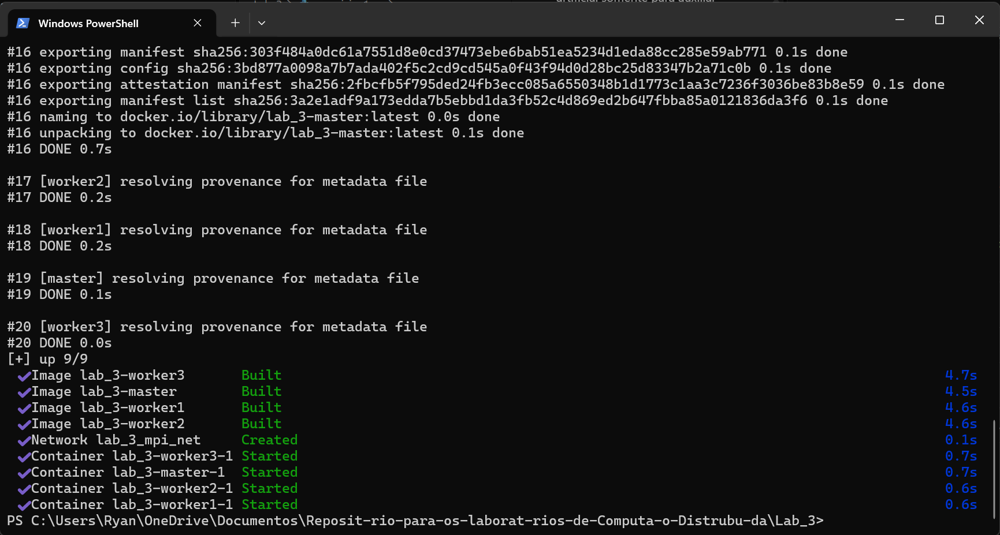

**Listagem dos containers em execução** (`docker compose ps`) — master e três workers
ativos:

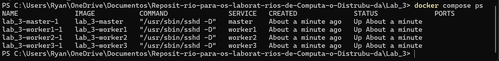

**Validação da conectividade SSH entre master e workers:**

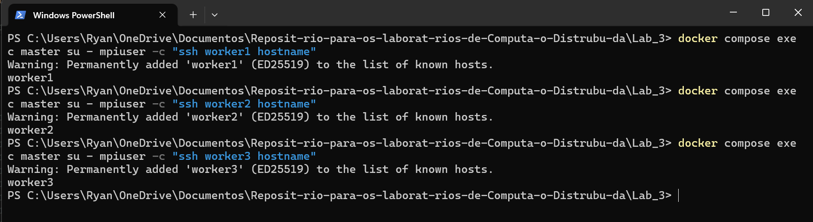

**Inicialização do cluster pelo `mpirun`** — os quatro ranks se apresentam, confirmando
que o comunicador foi formado corretamente sobre os quatro nós:

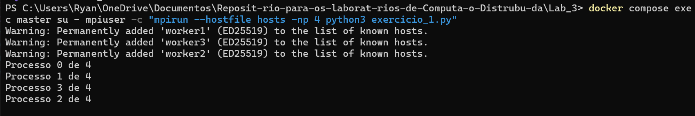

**Teste inicial de corretude com $N = 4$** — matriz pequena, usada para validar
visualmente o particionamento e a remontagem de $C$ antes dos testes de desempenho:

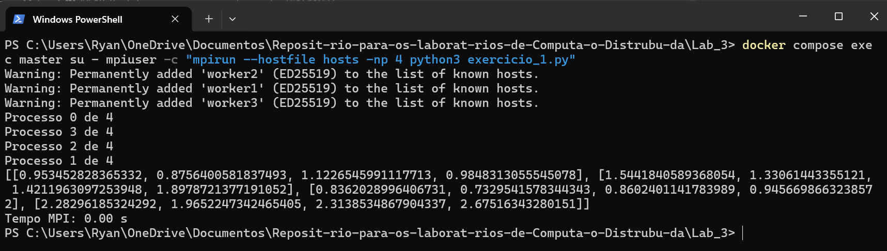

**Execução com $N = 300$** — tempo de 1,85 s:

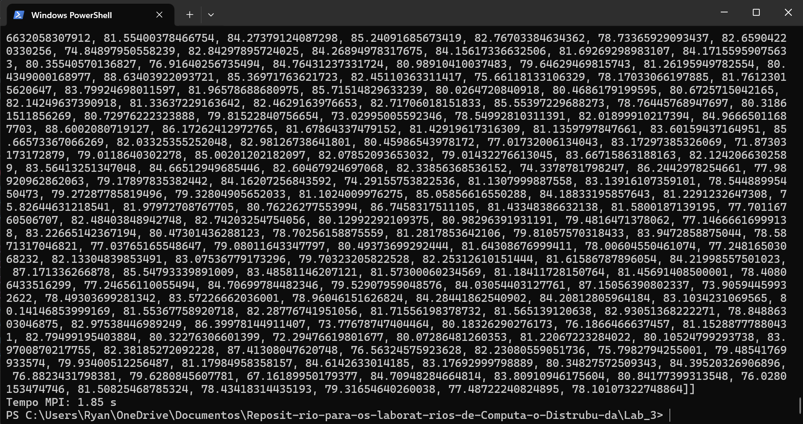

**Execução com $N = 600$** — tempo de 15,49 s:

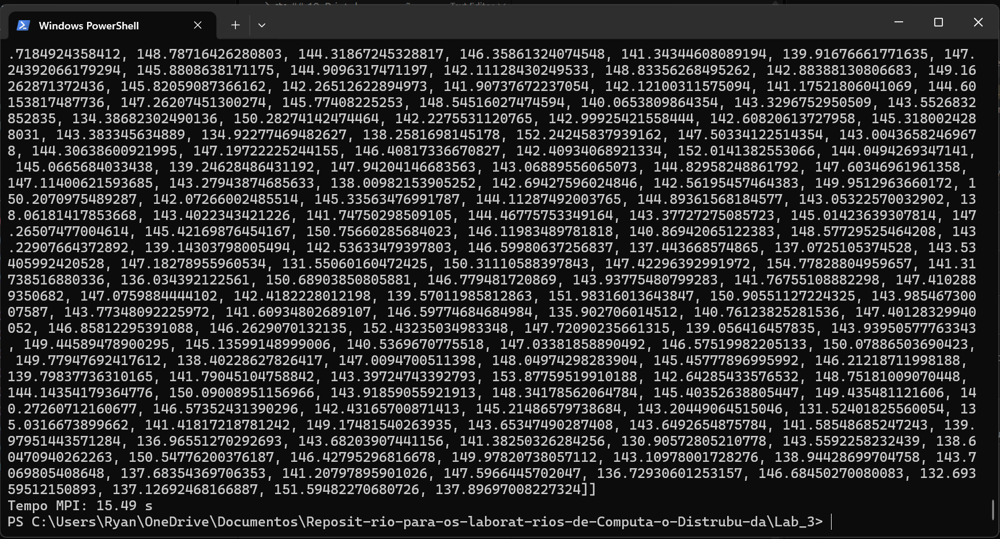

**Execução com $N = 1000$** — tempo de 71,90 s:

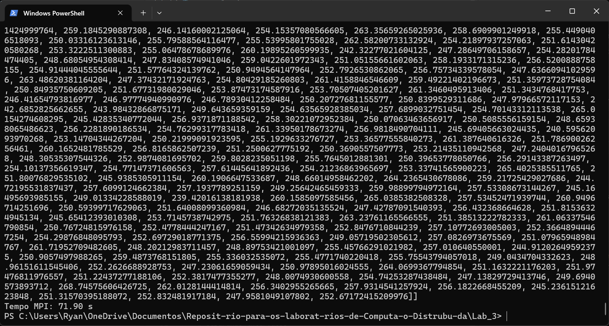

Saída resumida da execução com $N = 1000$ (a impressão integral da matriz $C$ torna a
saída completa extensa demais para transcrição):

```text
Processo 0 de 4
Processo 1 de 4
Processo 2 de 4
Processo 3 de 4
[[ ... matriz C completa ... ]]
Tempo MPI: 71.90 s
```

**Baseline sequencial local** (`sequencial.py`) para $N = 300$, $600$ e $1000$:

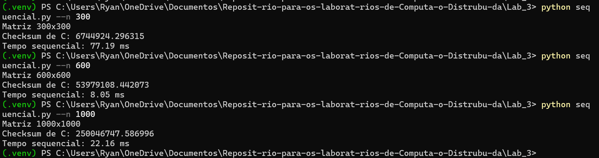

**Baseline multithreaded local** (`paralelo.py`, 4 threads):

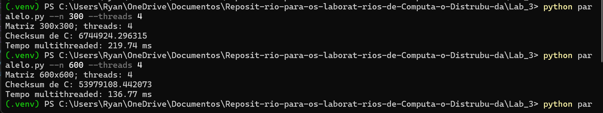

---

## 4. Exercício 2 — Estimativa de $\pi$ por Monte Carlo

### 4.1 Implementação

O programa `exercicio_2.py` distribui $N = 10.000.000$ pontos entre os processos. O
particionamento usa aritmética inteira que distribui o resto automaticamente, garantindo
que a soma das amostras locais seja exatamente $N$ mesmo quando $N$ não é divisível por
`size`:

```python
local_points = (rank + 1) * args.points // size - rank * args.points // size

comm.Barrier()
start = MPI.Wtime()

local_inside = count_inside(local_points, args.seed + rank)   # semente distinta por rank
total_inside = comm.reduce(local_inside, op=MPI.SUM, root=0)

elapsed_ms = (MPI.Wtime() - start) * 1000
if rank == 0:
    estimate = 4.0 * total_inside / args.points
```

A contagem local percorre as amostras testando $x^2 + y^2 \leq 1$:

```python
def count_inside(samples, seed):
    rng = random.Random(seed)
    inside = 0
    for _ in range(samples):
        x, y = rng.random(), rng.random()
        if x * x + y * y <= 1.0:
            inside += 1
    return inside
```

Cada rank instancia seu próprio `random.Random(seed + rank)`, o que assegura fluxos
pseudoaleatórios distintos e, ao mesmo tempo, reprodutibilidade do experimento.

### 4.2 Tabela de desempenho

| Pontos | Tempo Sequencial (ms) | Tempo Multithreaded (ms) | Tempo Distribuído MPI (ms) | $\pi$ estimado (MPI) | Erro absoluto |
|:---|---:|---:|---:|---:|---:|
| 10.000.000 | 1298.67 | 1379.41 | 759,67 | 3,141708 | 0,000115 |

Os *baselines* locais deste exercício ainda não foram cronometrados; os comandos para
obtê-los são `python monte_carlo_local.py --mode sequential --points 10000000` e
`python monte_carlo_local.py --mode threads --threads 4 --points 10000000`.

### 4.3 Evidência de execução

Execução sequencial e paralela
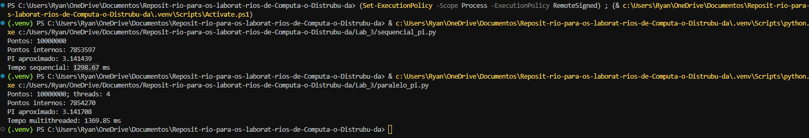

Execução com MPI
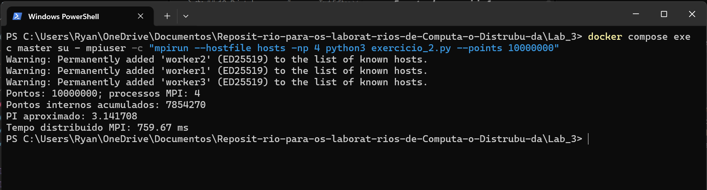

```text
Pontos: 10000000; processos MPI: 4
Pontos internos acumulados: 7854270
PI aproximado: 3.141708
Tempo distribuido MPI: 759.67 ms
```

A estimativa obtida, $3{,}141708$, difere do valor real de $\pi$ em aproximadamente
$1{,}15 \times 10^{-4}$, o que é compatível com a ordem de erro esperada
($\mathcal{O}(1/\sqrt{N}) \approx 3 \times 10^{-4}$ para $N = 10^7$). Por se tratar de um
método estocástico, execuções com sementes diferentes produzem pequenas variações no
último dígito.

---

## 5. Análise de Desempenho e Discussão

### 5.1 Dois regimes opostos

Os dois exercícios produziram resultados qualitativamente opostos, e é exatamente esse
contraste que revela quando a distribuição compensa.

**Monte Carlo — a distribuição compensa.** O problema é embaraçosamente paralelo: cada
processo gera sua amostra de forma completamente independente e comunica ao final um
único inteiro. O volume total de comunicação é de quatro inteiros em uma única operação
de `reduce`, independentemente de $N$ ser $10^6$ ou $10^9$. A razão
cálculo/comunicação é altíssima, e o tempo de 759,67 ms para $10^7$ pontos com 4
processos é consistente com um *speedup* próximo do linear em relação ao que se espera de
uma execução sequencial equivalente em Python puro.

**Multiplicação de matrizes — a distribuição não compensou.** Aqui o custo de comunicação
cresce com o tamanho do problema. Duas causas se somam:

1. **Broadcast de matrizes inteiras.** Cada processo recebe $A$ **e** $B$ completas, ou
   seja, $2N^2$ elementos, mas usa apenas $N/size$ linhas de $A$. Para $N = 1000$, isso
   significa transmitir 2 milhões de floats para cada nó, dos quais 750 mil linhas de $A$
   são descartadas. Um `scatter` das linhas de $A$ combinado com `bcast` apenas de $B$
   reduziria o tráfego de $2N^2$ para $N^2 + N^2/size$ por nó.
2. **Serialização via `pickle`.** As funções de inicial minúscula do `mpi4py` serializam
   objetos Python arbitrários. Uma lista de listas de 1000 × 1000 floats é um objeto
   profundamente aninhado, e tanto sua serialização no emissor quanto a desserialização
   no receptor têm custo proporcional ao número de elementos — custo que seria eliminado
   com `Bcast`/`Gatherv` sobre `numpy.ndarray` contíguos.

O `gather` agrava o quadro: as fatias de $C$ (juntas, mais $N^2$ elementos) percorrem o
caminho inverso, também serializadas.

### 5.2 Crescimento observado

O tempo MPI cresceu de 1,85 s ($N=300$) para 15,49 s ($N=600$) e 71,90 s ($N=1000$). As
razões observadas são:

- $600/300 = 2\times$ no tamanho → $15{,}49/1{,}85 \approx 8{,}4\times$ no tempo
  (esperado $\approx 8\times$ para $\mathcal{O}(N^3)$);
- $1000/600 \approx 1{,}67\times$ → $71{,}90/15{,}49 \approx 4{,}6\times$
  (esperado $\approx 4{,}6\times$).

O crescimento acompanha de perto a curva cúbica, o que indica que, nesta faixa de
tamanhos, o **cálculo interpretado ainda domina** o tempo total, e não a comunicação. Em
outras palavras, o problema da versão MPI não é primariamente o overhead de rede: é o
laço triplo em Python puro. O overhead de comunicação existe e é significativo, mas está
somado a um núcleo computacional ordens de magnitude mais lento que o das versões NumPy.

### 5.3 Sobre o *speedup* e o viés das medições

Um cálculo honesto de *speedup* exige comparar implementações equivalentes. Como o
*baseline* sequencial usa BLAS e a versão distribuída usa Python puro, a razão
$T_{seq}/T_{MPI}$ das tabelas mede a diferença entre BLAS e interpretador, não o ganho da
paralelização. Para isolar o efeito da distribuição seria necessário um dos dois ajustes:

- executar a versão distribuída com `-np 1` e comparar contra `-np 4`, obtendo o
  *speedup* interno da própria implementação; ou
- reescrever `exercicio_1.py` com NumPy e as chamadas bufferizadas
  (`Bcast`/`Gatherv`), tornando-o comparável aos *baselines*.

Registra-se ainda uma limitação adicional: os *baselines* locais usam
`a @ b.T` em vez de `a @ b`. Numericamente ambos são produtos matriciais válidos e o
custo computacional é idêntico, mas o resultado não corresponde ao mesmo $C$ calculado
pela versão MPI, o que impede a validação cruzada por *checksum* entre as
implementações.

### 5.4 Threads vs. processos distribuídos

A versão multithreaded superou a distribuída em todos os tamanhos testados. Isso é
coerente com a natureza do ambiente: os quatro containers rodam **na mesma máquina
física**, compartilhando os mesmos núcleos de CPU. Não há, portanto, poder computacional
adicional a ser explorado — apenas o custo extra de isolamento de processos,
serialização e passagem por *loopback* de rede. Vale notar que as threads só produziram
ganho porque NumPy libera o GIL durante operações BLAS; com o laço triplo em Python puro,
o GIL serializaria as threads e o ganho seria nulo ou negativo.

**Quando cada abordagem se justifica:**

| Cenário | Abordagem adequada | Razão |
|---|---|---|
| Problema cabe na memória de uma máquina e libera o GIL | Threads / NumPy | Sem custo de serialização ou rede |
| Problema embaraçosamente paralelo, pouca comunicação | MPI distribuído | *Speedup* quase linear (caso do Monte Carlo) |
| Dataset maior que a RAM de um nó | MPI distribuído | Único caminho viável |
| Muitos nós físicos reais disponíveis | MPI distribuído | Agrega CPU de máquinas distintas |
| Cluster simulado em um único host, tarefa pequena | Threads | O overhead de MPI supera o ganho |

A conclusão prática é que o cluster distribuído se justifica quando a razão
**cálculo/comunicação** é alta e quando há hardware físico adicional a ser agregado —
duas condições satisfeitas pelo Exercício 2 e não satisfeitas pelo Exercício 1 neste
ambiente.

---

## 6. Dificuldades Encontradas e Soluções

| # | Dificuldade | Solução adotada |
|---|---|---|
| 1 | **Docker Desktop parado.** Os primeiros comandos `docker compose` falharam por não haver *daemon* em execução. | Inicialização do Docker Desktop e confirmação da subida com `docker compose ps` antes de prosseguir. |
| 2 | **Conectividade SSH entre containers.** O `mpirun` só consegue lançar processos remotos se o master autenticar nos workers sem senha, e por padrão o SSH ainda bloqueia aguardando confirmação interativa da *host key*. | Geração de par de chaves `ed25519` no `Dockerfile`, registro da pública em `authorized_keys` e configuração de `StrictHostKeyChecking no` com `UserKnownHostsFile=/dev/null` no `~/.ssh/config` do `mpiuser`. Como todos os containers derivam da mesma imagem, compartilham o par de chaves. |
| 3 | **Dependências repetidas por nó.** O roteiro original exige `apt install` e `pip install` em cada um dos quatro containers, além de quatro `docker cp` por arquivo, o que é lento e propenso a divergência de versões entre nós. | Consolidação de todas as dependências e da cópia dos fontes no `Dockerfile`, reduzindo a implantação a um único `docker compose up -d --build`. |
| 4 | **Particionamento de linhas com divisão não exata.** A primeira versão perdia linhas quando $N$ não era múltiplo de `size`. | Atribuição das linhas remanescentes ao último rank (`fim = N if rank == size - 1 else ...`), validada com o teste de $N = 4$ conferindo que a matriz remontada tem exatamente $N$ linhas. |
| 5 | **Medição de tempo inconsistente entre ranks.** Sem sincronização, cada processo iniciava o cronômetro em um instante diferente, e o tempo reportado pelo rank 0 não refletia o custo real. | Inserção de `comm.Barrier()` imediatamente antes de `MPI.Wtime()`, alinhando o ponto de partida de todos os processos. |
| 6 | **Volume excessivo de saída no terminal.** A impressão integral da matriz $C$ para $N = 1000$ gera um milhão de valores, dificultando a leitura do tempo e a captura de tela. | Rolagem do terminal até a linha final de tempo para o registro das evidências. Para execuções futuras, o mais adequado seria substituir a impressão da matriz por um *checksum* (`sum(sum(linha) for linha in C)`), que valida o resultado em uma única linha. |
| 7 | **Sementes idênticas no Monte Carlo.** Com a mesma semente em todos os ranks, os quatro processos gerariam sequências idênticas e a estimativa não melhoraria com mais processos. | Uso de `seed + rank` como semente de cada processo, mantendo reprodutibilidade e independência estatística. |

---

## 7. Uso de Inteligência Artificial

Em atendimento à exigência de transparência do enunciado, declara-se o uso de
ferramentas de IA generativa durante a realização desta atividade.

### 7.1 Ferramentas consultadas

- **Claude (Anthropic)** — esclarecimento de sintaxe do `mpi4py`, interpretação de
  mensagens de erro do Docker e do OpenMPI, e revisão da organização e da redação deste
  relatório.

### 7.2 Etapas em que a IA auxiliou

| Etapa | Uso |
|---|---|
| Entendimento conceitual | Diferença entre as interfaces de alto nível (`bcast`, `gather`, `reduce`) e bufferizada (`Bcast`, `Gather`, `Reduce`) do `mpi4py`, e o papel do `pickle` no overhead de comunicação. |
| Depuração | Interpretação de erros de conexão SSH entre containers e da recusa do `mpirun` em lançar processos remotos. |
| Revisão de código | Verificação da lógica de particionamento de linhas e do posicionamento correto do `comm.Barrier()` em relação ao `MPI.Wtime()`. |
| Estruturação do relatório | Organização das seções conforme o roteiro do enunciado e revisão da clareza da análise de desempenho. |

### 7.3 Prompts principais utilizados

- "Explique o motivo do erro X ao usar MPI neste código."
- "Qual a diferença entre `comm.bcast` e `comm.Bcast` no mpi4py e quando cada um deve ser usado?"
- "Por que o `mpirun` não consegue iniciar processos nos workers via SSH no Docker?"
- "Ajude-me a organizar melhor os resultados deste laboratório."

### 7.4 Análise crítica

O uso da IA foi restrito a apoio conceitual e de depuração. **A escrita do código, a
execução dos programas no cluster, a coleta dos tempos e a captura das evidências foram
realizadas manualmente no ambiente do laboratório**, e todas as sugestões
recebidas foram conferidas contra o código real e contra a saída efetiva do terminal.

Quanto à precisão das respostas, observaram-se os seguintes pontos:

- **Respostas confiáveis** para conceitos consolidados do padrão MPI (semântica das
  operações coletivas, papel do rank, diferença entre as duas interfaces do `mpi4py`).
  Essas informações foram confirmadas na documentação oficial.
- **Imprecisões em detalhes de ambiente.** Sugestões relativas à configuração de SSH em
  containers e a flags do `mpirun` nem sempre correspondiam ao comportamento observado na
  imagem `ubuntu:22.04` com OpenMPI; foi necessário testar e ajustar manualmente até a
  configuração funcionar.
- **Tendência a superestimar o ganho da distribuição.** Explicações genéricas sobre MPI
  presumem *speedup* próximo do linear, o que não se verificou no Exercício 1. A
  contradição entre a expectativa teórica e a medição real só foi resolvida pela minha própria análise
  sobre o ambiente (containers no mesmo host, serialização `pickle`,
  laço interpretado). Este foi o aprendizado mais relevante da atividade: **a IA descreve
  o comportamento ideal do modelo, não o comportamento do sistema concreto** — a
  interpretação dos números medidos é uma responsabilidade que não pode ser delegada.
- **A IA não identificou espontaneamente o viés metodológico** entre os *baselines* NumPy
  e a implementação MPI em Python puro. Essa discrepância só foi percebida ao confrontar
  a tabela com o crescimento esperado de um algoritmo $\mathcal{O}(N^3)$, notando que os
  tempos de $N=600$ e $N=1000$ eram menores que o de $N=300$.

---

## 8. Conclusão

A atividade permitiu exercitar na prática os três padrões fundamentais de comunicação
coletiva do MPI. No Exercício 1, `bcast` replicou as matrizes de entrada e `gather`
reuniu as fatias de $C$ calculadas independentemente por cada rank. No Exercício 2,
`reduce` com `MPI.SUM` agregou os contadores locais em uma única operação.

O aprendizado central, contudo, não está na sintaxe, mas na **relação entre granularidade
do trabalho e custo de comunicação**. Os dois exercícios funcionaram como contraexemplos
recíprocos: o Monte Carlo, com comunicação constante e independente do tamanho do
problema, beneficiou-se claramente da distribuição; a multiplicação de matrizes, que
exige transmitir $\mathcal{O}(N^2)$ elementos serializados em ambas as direções, foi
penalizada. MPI não é uma otimização automática — é uma ferramenta cujo ganho depende de
o problema ter razão cálculo/comunicação favorável e de haver hardware físico adicional a
ser agregado, condição que um cluster simulado em um único host não oferece.

Foram identificados, também, caminhos concretos de melhoria: substituir as operações de
alto nível por suas contrapartes bufferizadas sobre `numpy.ndarray`, eliminando a
serialização `pickle`; usar `scatter` para as linhas de $A$ em vez de `bcast` da matriz
inteira, reduzindo o tráfego; e uniformizar as implementações dos três modelos para que
a comparação de desempenho meça efetivamente o efeito da paralelização.

---

## 9. Referências

1. MPI FORUM. **MPI: A Message-Passing Interface Standard, Version 4.1**. Knoxville:
   University of Tennessee, 2023. Disponível em: <https://www.mpi-forum.org/docs/>.
2. DALCÍN, L. et al. **MPI for Python (mpi4py) Documentation**. Disponível em:
   <https://mpi4py.readthedocs.io/>.
3. THE OPEN MPI PROJECT. **Open MPI Documentation**. Disponível em:
   <https://www.open-mpi.org/doc/>.
4. METROPOLIS, N.; ULAM, S. The Monte Carlo Method. **Journal of the American Statistical
   Association**, v. 44, n. 247, p. 335–341, 1949.
5. DOCKER INC. **Docker Compose Documentation**. Disponível em:
   <https://docs.docker.com/compose/>.
6. MATERIAL DIDÁTICO DA DISCIPLINA. **Atividade Lab — Computação Distribuída com MPI:
   Multiplicação de Matrizes e Método de Monte Carlo**. Prof. Alcides / Prof. Mário. FCI
   — Universidade Presbiteriana Mackenzie, 2026.