# Processamento Distribuído de Imagens Médicas com MPI

**Laboratório 4 — MPI + Python + Docker**

| Identificação | Informação |
|---|---|
| Instituição | Universidade Presbiteriana Mackenzie — Faculdade de Computação e Informática |
| Curso | Ciência da Computação |
| Disciplina | Computação Distribuída |
| Aluno | Ryan Ledo |
| RA | 10352727 |
| Turma | 06N |
| Professor | Prof. Mário |

## 1. Introdução e Fundamentos Teóricos

O objetivo deste laboratório é implementar uma simulação de análise de radiografias
em tons de cinza usando paralelismo de dados. A imagem é representada por uma matriz
bidimensional de intensidades entre 0 e 255, dividida em faixas horizontais contíguas.
Cada processo examina sua faixa, calcula estatísticas e participa da consolidação no
processo coordenador. Trata-se de uma simulação didática, sem finalidade diagnóstica real.

O MPI organiza a comunicação entre processos com espaços de memória independentes.
O comunicador `MPI.COMM_WORLD` identifica o grupo participante, `rank` identifica cada
processo e `size` informa a quantidade total de processos. O rank 0 coordena a execução
e também analisa sua própria faixa.

As operações coletivas implementadas são `bcast`, para os parâmetros globais; `scatter`,
para a distribuição das faixas; `Barrier`, para delimitar as fases; `reduce`, para somas
e máximo globais; e `gather`, para preservar a auditoria individual. Os métodos de
comunicação de objetos em Python usam serialização, que acrescenta custo ao tráfego
de dados [2].

A análise de desempenho considera a fração serial e os custos de comunicação. Pela
Lei de Amdahl, um modelo ideal de speedup é `S(p) = 1 / (f + (1-f)/p)`, em que `f`
representa a fração serial. Comunicação, sincronização, geração centralizada da imagem
e competição por recursos adicionam limitações que esse modelo simplificado não mede.

## 2. Metodologia e Arquitetura do Cluster

### 2.1 Ambiente utilizado

O projeto configura quatro serviços Docker: `master`, `worker1`, `worker2` e `worker3`.
Todos usam a mesma imagem baseada em Ubuntu 22.04, com Python, NumPy, mpi4py,
Open MPI e servidor SSH. O processo MPI é iniciado como `mpiuser`. O arquivo `hosts`
declara um slot por host; oito processos usam oversubscription. Um slot é uma unidade
de alocação do MPI, não uma comprovação de CPU física disponível [3].

A pasta do laboratório é montada em `/home/mpiuser/lab` em todos os containers.
Isso mantém os scripts no mesmo caminho e persiste os resultados no computador
do aluno. A rede Docker é compartilhada apenas entre os serviços do projeto. Os
containers compartilham os recursos da máquina virtual do Docker Desktop: não se
deve interpretar o experimento como um cluster de quatro máquinas físicas.

As versões e especificações foram registradas em `resultados/ambiente.txt`.
`lscpu` mostra a topologia visível; `cpu.max` e `memory.max` registram possíveis limites
de cgroup. Esses valores não devem ser confundidos com hardware dedicado a cada nó.

<!-- AUTO:AMBIENTE:INICIO -->

| Componente | Configuração registrada |
|---|---|
| Sistema dos containers | Ubuntu 22.04, sobre WSL2, arquitetura x86_64 |
| Processador identificado | AMD Ryzen 5 7535U with Radeon Graphics |
| Topologia visível | 6 núcleos, 2 threads por núcleo, 12 processadores lógicos |
| Python | 3.10.12 |
| Open MPI | 4.1.2 |
| NumPy | 1.21.5 |
| mpi4py | 3.1.3 |
| Limite de CPU no cgroup consultado | `max 100000`, sem quota explícita |
| Limite de memória no cgroup consultado | `max`, sem limite explícito |

O acesso SSH retornou os nomes dos quatro hosts, e `nproc` indicou 12 processadores
lógicos visíveis em cada um. Esses recursos são compartilhados. A ausência de
limite explícito no cgroup consultado não significa memória ou CPU ilimitadas:
continuam valendo os limites do host e da máquina virtual.

<!-- AUTO:AMBIENTE:FIM -->

### 2.2 Geração e parâmetros da imagem

A geração usa `numpy.random.default_rng` com semente 42. Para a mesma configuração
e ambiente, a imagem é reproduzível entre as execuções com diferentes quantidades
de processos. Há um fundo de baixa intensidade, um gradiente vertical suave e duas
regiões elípticas com intensidades normais. O foco padrão ocupa aproximadamente as
linhas de 30% a 45% da altura e as colunas de 60% a 80% da largura, no lado direito
matricial, com intensidades inteiras de 180 a 244. As coordenadas são proporcionais,
permitindo comparar diferentes tamanhos sem manter um foco de área absoluta fixa.

Pixels suspeitos obedecem estritamente a `pixel > 200`; pixels altamente suspeitos
obedecem a `pixel > 230`. A classificação é CRÍTICA quando pelo menos 5% dos pixels são suspeitos ou
pelo menos 1% são altamente suspeitos. Fora dessas condições, a faixa é NORMAL
abaixo de 1% de suspeitos e ATENÇÃO a partir de 1%. Como o enunciado
também pede presença expressiva de pixels altamente suspeitos sem fixar o percentual,
adotou-se explicitamente **1% de pixels altamente suspeitos** como critério alternativo
de faixa crítica, configurável por `--pct-altos`. Esse critério também vale globalmente.

A classificação global aplica a regra às contagens totais, sem tomar a faixa mais
grave como classificação automática de toda a imagem. Por isso, uma faixa crítica
pode coexistir com um diagnóstico global de atenção.

### 2.3 Correspondência com as 12 etapas

| Etapa | Implementação |
|---:|---|
| 1 | Inicialização de `COMM_WORLD`, rank e size. |
| 2 | Geração da imagem sintética apenas no rank 0. |
| 3 | Difusão do dicionário de parâmetros com `comm.bcast`. |
| 4 | Barreira após o recebimento da configuração. |
| 5 | Distribuição de faixas balanceadas com `comm.scatter`. |
| 6 | Contagem, soma, máximo e lateralidade por faixa. |
| 7 | Classificação local por percentuais de suspeitos e altos. |
| 8 | Pausa `0.5 × rank` segundos nos ranks ímpares, configurável. |
| 9 | Barreira antes da consolidação e medição da espera local. |
| 10 | Seis reduções `MPI.SUM` e uma redução `MPI.MAX`. |
| 11 | Coleta dos dicionários de auditoria com `comm.gather`. |
| 12 | Relatório consolidado, classificação global e JSON opcional. |

As operações NumPy examinam todos os pixels por comparações vetorizadas. A soma
usa acumulador de 64 bits e conversão para inteiro Python, evitando overflow de
`uint8`. O fracionamento preserva todas as linhas, inclusive quando há resto.
Faixas vazias, possíveis quando há mais processos do que linhas, contribuem com
zero e recebem a indicação SEM DADOS, sem divisão por zero ou máximo de vetor vazio.

### 2.4 Protocolo experimental

Foram executados os casos de 500 × 500, 2000 × 2000 e 4000 × 4000, com 1, 2, 4 e 8 processos,
com atraso zero e com fator de atraso 0,5. A dimensão opcional de 6000 × 6000 não foi utilizada. O caso
2003 × 2000 com quatro processos testa a divisibilidade. Foram feitas três repetições por caso, totalizando 75 execuções.
A comparação usa a mediana dos tempos, com os registros individuais preservados
nos arquivos JSON e TXT. As 75 execuções registraram concordância entre as sete
métricas distribuídas e a referência serial.

O tempo medido no root vai do início do programa após a leitura de argumentos até
o retorno do `gather`: inclui geração, comunicação, análise, pausas e barreiras.
Exclui o lançamento do `mpirun`, impressão, escrita de arquivos e verificação serial.
Não se trata de tempo exclusivo do núcleo de análise. A referência `T1` é o mesmo
programa com um processo, incluindo seus custos MPI, e não uma versão serial otimizada.

Cada execução da bateria compara as sete métricas globais com uma análise serial
da mesma matriz. Essa verificação fica fora da região medida. Os logs e os JSONs
permitem conferir os valores usados na tabela; nenhum tempo é estimado antecipadamente.

## 3. Evidências Experimentais — Capturas de Tela

As capturas a seguir registram a preparação do cluster e execuções individuais.
A tabela de desempenho da seção 4 usa as medianas da bateria salva em `resultados/`,
não os tempos isolados dos prints. Por isso, os valores de tempo podem diferir
entre as figuras e a tabela, mesmo com os mesmos parâmetros.

**Figura 1 — Construção da imagem, inicialização dos quatro containers, acesso SSH e testes.**

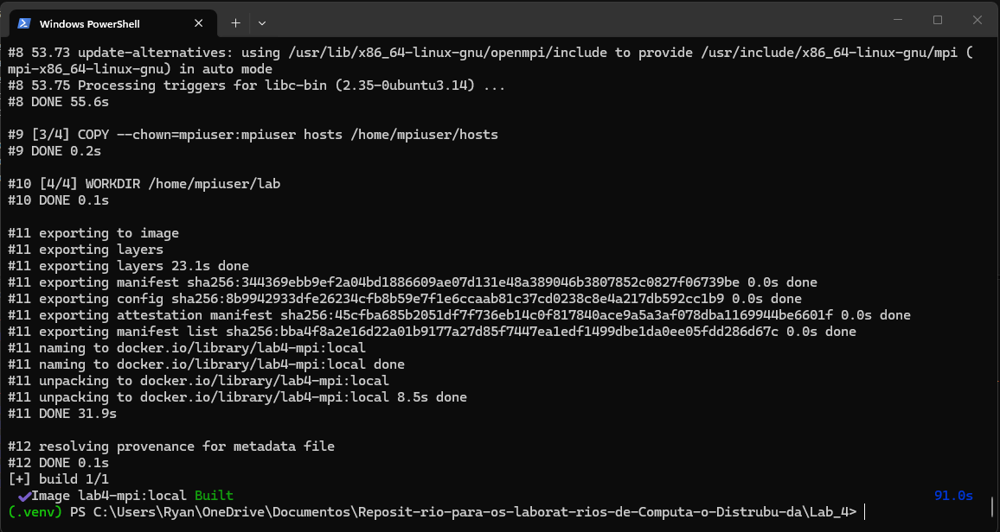

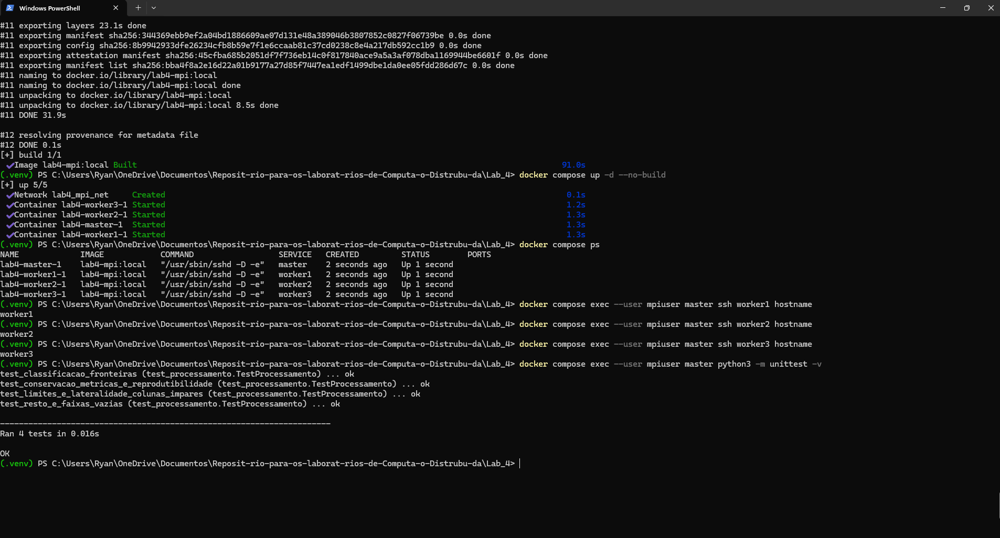

**Figura 2 — Imagem de 2000 × 2000 com 2 processos e atraso artificial.**

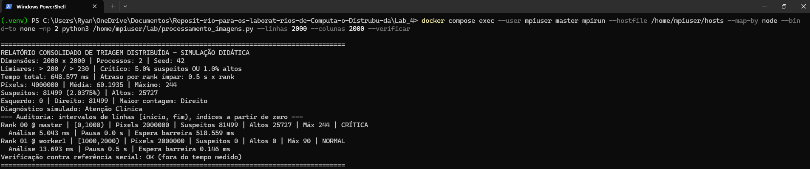

**Figura 3 — Imagem de 2000 × 2000 com 4 processos e atraso artificial.**

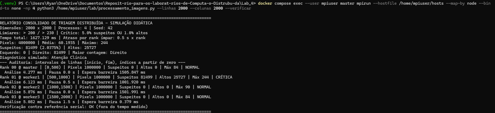

**Figura 4 — Imagem de 2000 × 2000 com 8 processos e atraso artificial.**

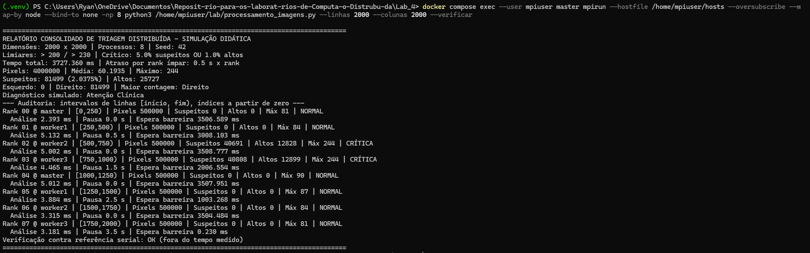

**Figura 5 — Imagem de 4000 × 4000 com 2 processos e atraso artificial.**

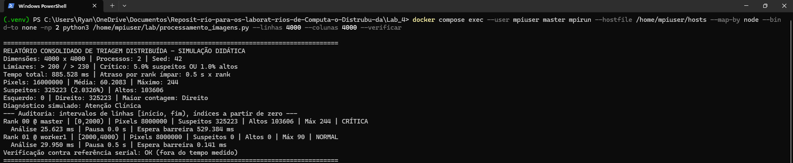

**Figura 6 — Imagem de 4000 × 4000 com 4 processos e atraso artificial.**

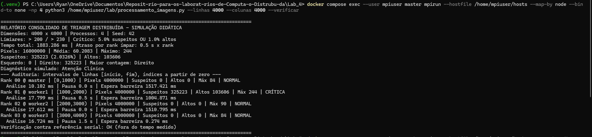

**Figura 7 — Imagem de 4000 × 4000 com 8 processos e atraso artificial.**

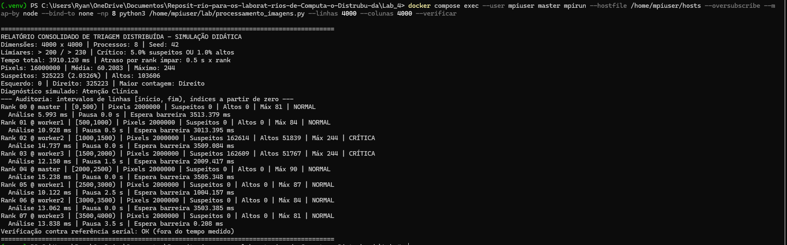

**Figura 8 — Imagem de 2003 × 2000 com quatro processos e divisão com resto.**

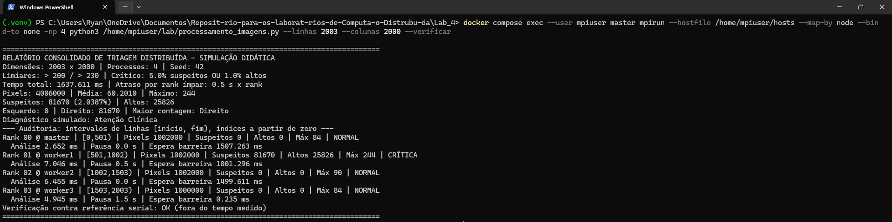

**Figura 9 — Imagem de 2000 × 2000 sem atraso artificial, com 2, 4 e 8 processos.**

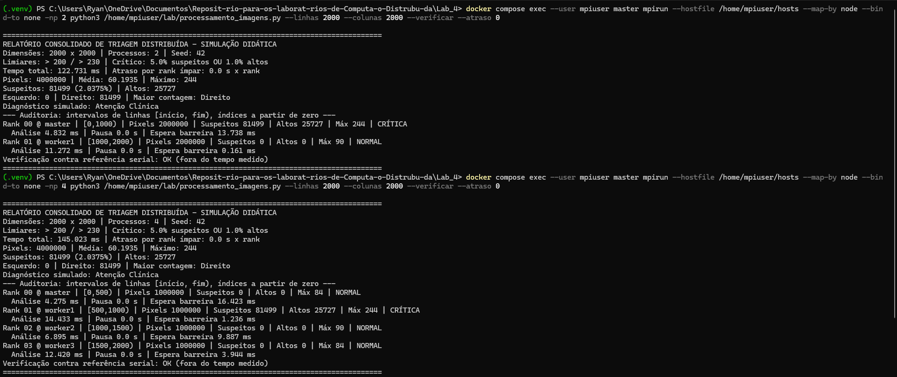

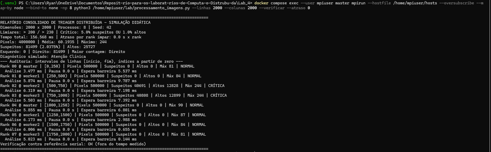

### 3.1 Auditoria extraída das execuções

<!-- AUTO:AUDITORIA:INICIO -->

A tabela abaixo resume a primeira repetição de cada dimensão com quatro processos e atraso artificial.

| Imagem | Pixels suspeitos | Altamente suspeitos | Suspeitos (%) | Média de intensidade | Diagnóstico |
|---|---:|---:|---:|---:|---|
| 500 × 500 | 4999 | 1587 | 2,000 | 60,141 | Atenção Clínica |
| 2000 × 2000 | 81499 | 25727 | 2,037 | 60,194 | Atenção Clínica |
| 4000 × 4000 | 325223 | 103606 | 2,033 | 60,208 | Atenção Clínica |
| 2003 × 2000 | 81670 | 25826 | 2,039 | 60,201 | Atenção Clínica |

Nesses quatro casos, todos os pixels suspeitos ficaram no lado direito, e o máximo foi 244.
Na imagem de 2000 × 2000, a divisão em quatro processos atribuiu um milhão de
pixels a cada rank. Os 81.499 suspeitos ficaram na faixa `[500,1000)`, do rank 1,
classificada como CRÍTICA; as demais faixas foram classificadas como NORMAL.
Globalmente, os suspeitos representaram aproximadamente 2,037% e os altamente
suspeitos, 0,643%. Assim, a classificação global foi Atenção Clínica, sem contradição
com a faixa crítica: os percentuais usam denominadores diferentes.

**Espera na barreira — primeira repetição de 2000 × 2000 com quatro processos:**

| Rank | Host | Faixa de linhas | Pausa (s) | Espera na barreira (ms) |
|---:|---|---|---:|---:|
| 0 | master | [0,500) | 0 | 1504,164 |
| 1 | worker1 | [500,1000) | 0.5 | 1001,634 |
| 2 | worker2 | [1000,1500) | 0 | 1503,159 |
| 3 | worker3 | [1500,2000) | 1.5 | 0,274 |

<!-- AUTO:AUDITORIA:FIM -->

## 4. Tabela Comparativa de Desempenho

Define-se `S(p) = T1/Tp` e `E(p) = S(p)/p`, comparando a mesma dimensão e o mesmo
fator de atraso. O rank 0 nunca recebe pausa, portanto o caso de um processo não
sofre atraso artificial. O speedup da série com pausas descreve o experimento
heterogêneo; a série sem pausas é o controle apropriado para examinar o custo de paralelização.

<!-- AUTO:TABELA:INICIO -->

Os tempos são medianas de três execuções, em milissegundos. O speedup e a
eficiência desta tabela usam a série **sem atraso** e sua referência de um processo.

| Imagem | Processos | Sem atraso (ms) | Com atraso (ms) | Speedup sem atraso | Eficiência sem atraso |
|---|---:|---:|---:|---:|---:|
| 500 × 500 | 1 | 8,641 | 6,401 | 1,000 | 100,00% |
| 500 × 500 | 2 | 13,338 | 514,484 | 0,648 | 32,39% |
| 500 × 500 | 4 | 28,282 | 1527,505 | 0,306 | 7,64% |
| 500 × 500 | 8 | 30,099 | 3542,767 | 0,287 | 3,59% |
| 2000 × 2000 | 1 | 81,444 | 75,936 | 1,000 | 100,00% |
| 2000 × 2000 | 2 | 98,659 | 589,180 | 0,826 | 41,28% |
| 2000 × 2000 | 4 | 96,656 | 1617,024 | 0,843 | 21,07% |
| 2000 × 2000 | 8 | 134,989 | 3652,455 | 0,603 | 7,54% |
| 4000 × 4000 | 1 | 364,812 | 367,764 | 1,000 | 100,00% |
| 4000 × 4000 | 2 | 426,970 | 846,259 | 0,854 | 42,72% |
| 4000 × 4000 | 4 | 384,978 | 1821,398 | 0,948 | 23,69% |
| 4000 × 4000 | 8 | 646,333 | 4149,600 | 0,564 | 7,06% |

No caso de 2003 × 2000 com quatro processos e atraso, a mediana foi de 1619,862 ms.

Com um processo, as duas configurações executam sem pausa, pois só existe o rank 0.
As diferenças entre suas medianas refletem a variação entre execuções, não um efeito
do parâmetro de atraso. Os arquivos individuais e `resumo.csv` preservam também
os valores mínimo e máximo de cada caso.

<!-- AUTO:TABELA:FIM -->

### 4.1 Análise discursiva da eficiência

Nenhuma configuração com múltiplos processos superou a referência de um processo
na série sem atraso. Isso indica que, para os tamanhos testados e para o intervalo
medido, o custo adicional de distribuir e consolidar os dados não foi compensado
pela divisão da análise.

<!-- AUTO:OBSERVACOES:INICIO -->

Para 2000 × 2000, o tempo sem atraso passou de 81,444 ms com um processo para
98,659 ms com dois, 96,656 ms com quatro e 134,989 ms com oito. Para 4000 × 4000,
quatro processos chegaram mais perto da referência: 384,978 ms contra 364,812 ms,
com speedup de 0,948 e eficiência de 23,69%. Ainda assim, não houve aceleração.

Oito processos apresentaram os maiores tempos sem atraso nas três dimensões.
O resultado é compatível com o aumento dos custos de comunicação e sincronização
e com a disputa por recursos, mas as medições não separam a contribuição de cada
fator. Além disso, a geração da imagem continuou centralizada no root.

Com atraso, a influência dos ranks lentos ficou mais evidente. Para 2000 × 2000,
as medianas foram 589,180 ms, 1617,024 ms e 3652,455 ms com 2, 4 e 8 processos.
A evolução acompanha o aumento da maior pausa programada: 500, 1500 e 3500 ms.
Portanto, essa série evidencia o custo de esperar pelos processos lentos e não
permite avaliar isoladamente o potencial de aceleração da análise.

<!-- AUTO:OBSERVACOES:FIM -->

## 5. Respostas às 9 Questões de Reflexão

### 5.1 Impacto do número de processos no tempo de execução

Não houve redução linear. Na série sem atraso, todas as configurações com 2, 4
e 8 processos foram mais lentas que a referência de um processo. Em 4000 × 4000,
por exemplo, quatro processos levaram 384,978 ms, contra 364,812 ms com um processo. A geração da matriz ocorre apenas no root e impõe
uma fração serial. Há ainda serialização dos blocos, transferências, reduções e
sincronização. Esses custos limitam o ganho previsto pela Lei de Amdahl. Além disso,
oito processos compartilham quatro containers e os recursos do mesmo host. Na série
com pausas, aumentar os ranks também aumenta a maior pausa programada; essa série
não representa escalabilidade pura de um volume fixo de trabalho computacional.

### 5.2 Influência de processos lentos — stragglers

As pausas programadas máximas são 0,5 s, 1,5 s e 3,5 s para 2, 4 e 8 processos,
respectivamente. São parâmetros do experimento, não tempos totais observados. A
barreira pré-consolidação impede que os processos avancem até que todos cheguem.
A espera apareceu nos resultados: no caso de 2000 × 2000 com quatro processos
da seção 3.1, o rank 0 aguardou 1504,164 ms na barreira, enquanto o rank 3,
que recebeu pausa de 1,5 s, aguardou apenas 0,274 ms. O efeito global não é a soma das pausas, pois os processos progridem em paralelo.

### 5.3 Papel prático de MPI_Barrier

A primeira barreira delimita a conclusão da parametrização antes da distribuição.
A segunda delimita o término da análise e das pausas antes da consolidação. Os
processos que chegam cedo permanecem na chamada até a chegada dos demais; o custo
de espera aparece em `barreira_ms`. Elas são obrigatórias no protocolo didático,
mas não são estritamente necessárias para a correção matemática deste programa:
as dependências das coletivas já permitem organizar os dados. Também não é correto
afirmar que toda operação coletiva equivale a uma barreira global.

### 5.4 Broadcast versus Scatter

Os parâmetros são pequenos e necessários integralmente em todos os processos;
por isso são difundidos com `bcast`. Cada processo precisa analisar apenas uma
faixa da imagem, por isso `scatter` distribui blocos diferentes. Difundir a matriz
completa replicaria aproximadamente `M × N` bytes de dados `uint8` em cada processo,
além de metadados e buffers, mesmo que cada um usasse apenas parte dela. O scatter
reduz a imagem útil nos workers a aproximadamente `M × N / p` bytes. O root ainda
mantém a matriz integral e arca com custos de particionamento e serialização.

### 5.5 Diferença prática entre Reduce e Gather

O `reduce` aplica soma às contagens de pixels, intensidades, suspeitos, altos e
lateralidades, e máximo ao pico de intensidade. A média global é a soma global
dividida pelo número global de pixels; não se faz média simples das médias locais,
pois as faixas podem ter tamanhos distintos. O `gather` preserva rank, hostname,
intervalo de linhas, classificação e tempos de cada faixa. Agregação matemática
e rastreabilidade individual têm finalidades distintas. Seria possível calcular
totais após gather, mas isso concentraria a lógica de redução no root e não
atenderia ao requisito de usar ambos os mecanismos.

### 5.6 Escalabilidade em imagens pequenas

Uma imagem de 500 × 500 contém 250 mil pixels. Nesse caso, o uso de múltiplos
processos não foi vantajoso: sem pausas, o tempo mediano aumentou de 8,641 ms
com um processo para 13,338 ms com dois, 28,282 ms com quatro e 30,099 ms com oito.
Os speedups foram, respectivamente, 0,648, 0,306 e 0,287.

Como a análise vetorizada exige pouco tempo por faixa, os custos de distribuição,
consolidação e sincronização pesam mais em relação ao trabalho útil. Esse resultado
mostra a importância da granularidade: dividir uma tarefa pequena em mais processos
pode aumentar seu tempo total. A medida ainda exclui o lançamento do `mpirun`, que
também contribui para o tempo percebido pelo usuário. Os valores de 500 × 500
foram obtidos dos registros da bateria; a Figura 9 mostra o controle sem atraso
de 2000 × 2000.

### 5.7 Detecção de lateralidade anatômica

A implementação segue a convenção do enunciado: colunas menores que `N//2` são
o lado esquerdo e as demais são o direito. Como as faixas são horizontais, cada
processo mantém todas as colunas e o mesmo ponto de separação. Para largura ímpar,
o lado direito contém uma coluna a mais; a implementação compara contagens
absolutas conforme o exemplo do guia, e não densidades normalizadas por lado.
A auditoria da seção 3.1 apresenta as contagens reais. A inferência depende dessa
convenção matricial, não de reconhecimento anatômico; uma radiografia clínica
exigiria tratamento de orientação e segmentação que não faz parte da atividade.

### 5.8 Balanceamento de carga

O particionamento atribui `M//p` linhas a todos os processos e uma linha adicional
aos primeiros `M%p` ranks. A diferença de trabalho em pixels é, no máximo, uma
linha. Isso não garante quantidades iguais de pixels suspeitos: o foco ocupa uma
região espacial localizada, podendo se concentrar em poucas faixas. Na imagem de 2000 × 2000 com quatro processos, por exemplo, todos receberam
um milhão de pixels, mas apenas o rank 1 identificou suspeitos. Com oito processos,
o foco ficou dividido entre os ranks 2 e 3, com 40.691 e 40.808 suspeitos,
respectivamente, como mostra a Figura 4. A análise vetorizada percorre todos os pixels,
de modo que a maior contagem de suspeitos não implica proporcionalmente mais
operações. As pausas dos ranks ímpares introduzem, separadamente, desequilíbrio
temporal intencional mesmo quando o volume de pixels é uniforme.

### 5.9 Divisibilidade: 2003 linhas com 4 processos

Como `2003 = 4 × 500 + 3`, os ranks 0, 1 e 2 recebem 501 linhas e o rank 3 recebe
500. Os intervalos, com início inclusivo e fim exclusivo, são `[0,501)`,
`[501,1002)`, `[1002,1503)` e `[1503,2003)`. A concatenação dessas faixas preserva
a imagem inteira, sem sobreposição, descarte ou padding. Para 2000 colunas, o
total matemático é 4.006.000 pixels. A Figura 8 confirma esse total, os quatro intervalos e a verificação serial
com resultado OK. O teste demonstrou que o resto da divisão foi distribuído
sem perda de dados.

## 6. Dificuldades Técnicas e Soluções

Um dos cuidados da implementação foi adaptar a divisão das linhas. O `np.split`
do esqueleto do enunciado pressupõe uma divisão exata, o que não atende ao teste
com 2003 linhas. A solução adotada distribui o resto entre os primeiros ranks.
O resultado foi conferido pela soma dos pixels e pela comparação com a análise serial.

Outro ponto foi manter o mesmo ambiente em todos os nós. Os quatro containers
usam a mesma imagem e acessam os scripts pelo mesmo caminho. A comunicação SSH
foi verificada a partir do master, conforme a Figura 1, que também registra os
quatro testes automatizados aprovados.

Na interpretação dos resultados, foi necessário separar o efeito das pausas
artificiais do custo da paralelização. A comparação apenas com atraso poderia
levar à conclusão de que toda a piora vinha da comunicação. Por isso, a análise
inclui a série sem atraso e mantém a geração da imagem dentro do tempo informado.
Também foi necessário distinguir os tempos de execuções isoladas dos prints das
medianas das três repetições usadas na tabela.

## 7. Declaração e Análise do Uso de IA

Foi utilizado o chatgpt como apoio à interpretação do enunciado, à
solução de dúvidas acerca de sintaxe em Python/MPI, à elaboração dos testes
e à organização e revisão deste relatório. 

As solicitações feitas à ferramenta incluíram sanar dúvidas do enunciado, implementação, dúvidas
sobre como gerar os testes corretamente e resultado dos testes. 

A principal vantagem desse apoio foi ganhar tempo em montar o template do relatorio, os testes
e debuggar o código. Dessa forma, foi possível focar na implementação do laboratório  4.

## 8. Conclusão e Referências

A implementação organiza a análise da imagem por faixas e integra os cinco
mecanismos exigidos, preservando tanto estatísticas globais quanto auditoria local.
O particionamento balanceado resolve a divisibilidade sem perda de pixels, e a
comparação serial fornece um critério de verificação das contagens e intensidades.

Nos testes sem atraso, nenhuma configuração com múltiplos processos foi mais
rápida que a referência de um processo. O caso mais próximo foi o de 4000 × 4000
com quatro processos, com speedup de 0,948. Com as pausas artificiais, os tempos
aumentaram conforme a espera pelo rank mais lento, evidenciando o efeito da
sincronização sobre o tempo global.

As 75 verificações contra a referência serial foram aprovadas, e o caso de 2003
linhas preservou os 4.006.000 pixels. Assim, os resultados confirmaram o funcionamento
do particionamento e da consolidação para os casos avaliados, ao mesmo tempo que
mostraram os limites de desempenho desse ambiente. Como os containers compartilham
o mesmo host e a imagem é sintética, essas conclusões não devem ser generalizadas
para um cluster físico ou para aplicações de diagnóstico clínico.

1. Material da disciplina. **Atividade Lab — Processamento Distribuído de Imagens
   Médicas com MPI**. Prof. Alcides / Prof. Mário. Arquivo
   `04-Lab_MPI_ProcessamentoImagensDistribuida.pdf`, fornecido no repositório.
2. MPI for Python. **Tutorial**. Disponível em:
   <https://mpi4py.readthedocs.io/en/stable/tutorial.html>.
3. Open MPI. **mpirun / mpiexec**. Disponível em:
   <https://docs.open-mpi.org/en/main/man-openmpi/man1/mpirun.1.html>.
