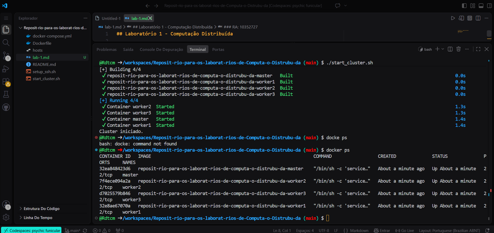
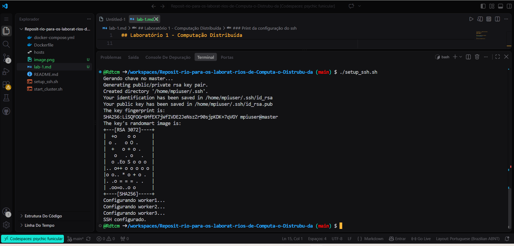
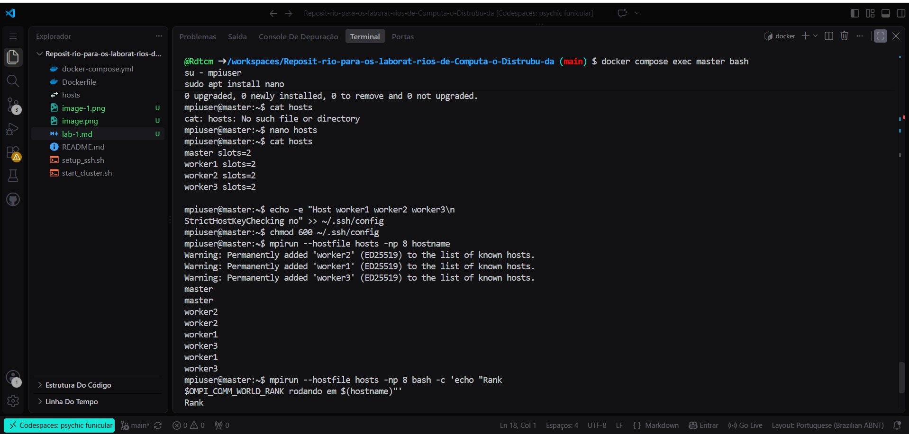
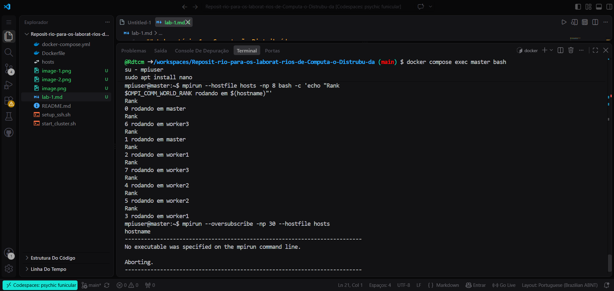
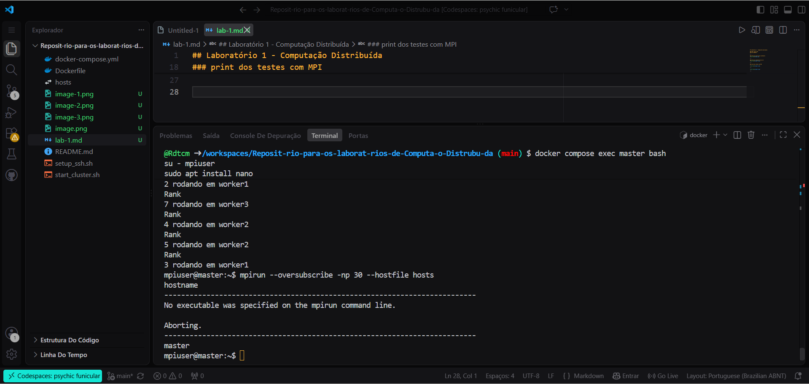

## Laboratório 1 - Computação Distribuída

### Nome: Ryan Ledo
### RA: 10352727

---

### Print da execução dos containers


---

### Print da configuração do ssh


---

### Print dos testes com MPI



---



---



---

## Exercício 1 – Frase distribuída em texto comum

Objetivo: cada processo MPI imprime uma palavra da frase “Olá Mack, sou o Ryan”, com uma palavra por processo, em 5 execuções independentes.

Saída observada no terminal:

```text
=== Exercício 1 – Frase distribuída em texto comum ===
Execução 1
[Rank 1 | master] Mack,
[Rank 0 | master] Olá
[Rank 2 | worker1] sou
[Rank 4 | worker2] Ryan
[Rank 3 | worker1] o

---
Execução 2
[Rank 0 | master] Olá
[Rank 1 | master] Mack,
[Rank 2 | worker1] sou
[Rank 4 | worker2] Ryan
[Rank 3 | worker1] o

---
Execução 3
[Rank 0 | master] Olá
[Rank 1 | master] Mack,
[Rank 4 | worker2] Ryan
[Rank 2 | worker1] sou
[Rank 3 | worker1] o

---
Execução 4
[Rank 0 | master] Olá
[Rank 1 | master] Mack,
[Rank 2 | worker1] sou
[Rank 4 | worker2] Ryan
[Rank 3 | worker1] o

---
Execução 5
[Rank 1 | master] Mack,
[Rank 0 | master] Olá
[Rank 2 | worker1] sou
[Rank 4 | worker2] Ryan
[Rank 3 | worker1] o
```

Análise:
- Cada processo executou uma palavra da frase, demonstrando paralelismo distribuído.
- A ordem de execução dos ranks não é determinística, o que é normal em MPI em ambiente de cluster.
- Mesmo com a troca de ordem, a frase final permanece correta: “Olá Mack, sou o Ryan”.
- A saída em texto comum ficou mais simples e mais fiel ao enunciado do exercício.

---

## Exercício 2 – Descobrir cores e threads

No Codespace, foram coletados os dados do host com os comandos:

```bash
nproc
lscpu
```

Saída observada:

```text
$ nproc
2

$ lscpu | egrep 'Architecture|CPU\(s\)|Thread\(s\) per core|Core\(s\) per socket|Socket\(s\)'
Architecture: x86_64
CPU(s): 2
Thread(s) per core: 2
Core(s) per socket: 1
Socket(s): 1
```

Interpretação:
- O ambiente possui 2 CPUs lógicos disponíveis.
- Há 1 core físico e 2 threads lógicas.
- A capacidade nominal do cluster é menor que o número de processos exigido em alguns testes, por isso o uso do `--oversubscribe` foi necessário.

Execução MPI observada:

```text
=== Exercício 2 – Descobrir cores e threads ===
Rank 0/1 no host master
Rank 0/2 no host master
Rank 1/2 no host master
Rank 0/16 no host master
Rank 1/16 no host master
Rank 2/16 no host master
Rank 3/16 no host master
Rank 5/16 no host worker1
Rank 6/16 no host worker1
Rank 7/16 no host worker1
Rank 4/16 no host worker1
Rank 9/16 no host worker2
Rank 8/16 no host worker2
Rank 11/16 no host worker2
Rank 15/16 no host worker3
Rank 12/16 no host worker3
Rank 13/16 no host worker3
Rank 14/16 no host worker3
Rank 10/16 no host worker2
```

Análise:
- Com 1 e 2 processos, o comportamento foi estável e previsível.
- Com 16 processos, o MPI precisou de `--oversubscribe`, mostrando que a execução ultrapassou a capacidade nominal do ambiente.
- Isso reforça a diferença entre capacidade real do sistema e capacidade forçada por escalonamento.

---

## Exercício 3 – Cluster soletrando o alfabeto

Objetivo: cada processo MPI imprime uma letra diferente do alfabeto, de A a Z, em texto simples, sem uso de banner.

Saída observada no terminal:

```text
=== Exercício 3 – Cluster soletrando o alfabeto ===
[Rank 4 | master] E
[Rank 0 | master] A
[Rank 1 | master] B
[Rank 2 | master] C
[Rank 5 | master] F
[Rank 6 | master] G
[Rank 21 | worker3] V
[Rank 11 | worker1] L
[Rank 12 | worker1] M
[Rank 22 | worker3] W
[Rank 13 | worker1] N
[Rank 24 | worker3] Y
[Rank 3 | master] D
[Rank 25 | worker3] Z
[Rank 7 | worker1] H
[Rank 16 | worker2] Q
[Rank 20 | worker3] U
[Rank 17 | worker2] R
[Rank 23 | worker3] X
[Rank 18 | worker2] S
[Rank 19 | worker2] T
[Rank 14 | worker2] O
[Rank 8 | worker1] I
[Rank 9 | worker1] J
[Rank 15 | worker2] P
[Rank 10 | worker1] K
```

Análise:
- Cada processo recebeu um valor distinto do alfabeto e imprimiu apenas sua letra.
- A ordem de execução varia conforme o escalonamento do cluster, mas o conjunto completo aparece corretamente.
- A execução deixa clara a ideia de paralelismo: vários processos trabalhando simultaneamente sobre uma mesma tarefa distribuída.
- Como a saída foi em texto simples, o resultado ficou mais limpo e fiel ao enunciado.

---

## Conclusão

Os 3 exercícios demonstraram de forma clara como o processamento distribuído em MPI funciona em prática:
- em paralelo, com múltiplos processos executando trechos distintos;
- com limitações impostas pelos recursos do ambiente;
- e com escalonamento dinâmico entre os containers do cluster.

O nome foi preenchido como Ryan, e os programas foram ajustados para a saída em texto comum, conforme solicitado.
